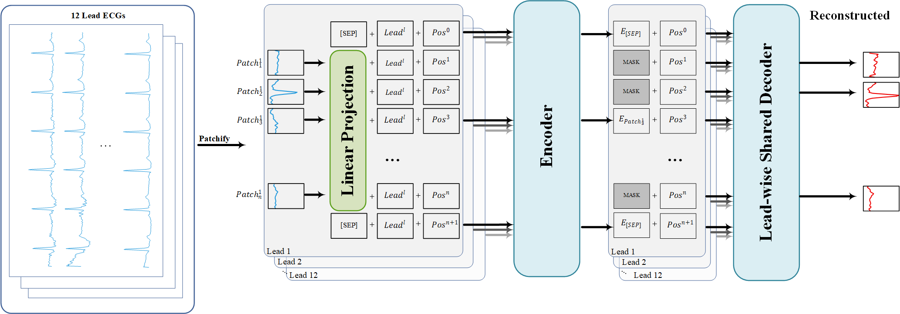

# [Physiological Measurement] Robust Detection of Chagas Disease via SpatioTemporal Masked Autoencoder

This is the offical implementation of our Physiological Measurement paper "[Robust Detection of Chagas Disease via SpatioTemporal Masked Autoencoder](https://iopscience.iop.org/journal/0967-3334)".

> Authors: Zijie Zhu, Jingming Zhang, Chen Xia, Shuang Qiu, Jinyu Wang, Hedi Li, Xiyuan Wang, Xin Xiong*,and Pan Xia* 


### Installation

To clone this repository:

```
git clone https://github.com/tigerforest0573/Kust_MeAI2025.git
```
### Environment Set Up

Install required packages:
```
conda create -n meai python=3.11
conda activate meai
pip install -r requirements.txt
```

The recommended minimum configuration for running the code is an environment with 16 vCPUs, 64 GB RAM, 100 GB of local storage in addition to the data, and an NVIDIA T4 GPU.
For improved training speed, we recommend using NVIDIA RTX 3090/4090/5090 GPUs or data center GPUs such as the NVIDIA A100, H100, etc.
### Prepare Data

Datasets we used are as follows:
[CODE-15% Dataset](https://zenodo.org/record/4916206#.YUG9MStxeUl).
[PTB-XL Dataset](https://physionet.org/content/ptb-xl/1.0.3/).
[Sami-Trop Dataset](https://zenodo.org/records/4905618).
[CODE-15% binary Chagas labels](https://moodychallenge.physionet.org/2025/data/code15_chagas_labels.zip).

#### CODE-15% dataset

These instructions use `code15_input` as the path for the input data files and `code15_output` for the output data files, but you can replace them with the absolute or relative paths for the files on your machine.

1. Download and unzip one or more of the `exam_part` files and the `exams.csv` file in the [CODE-15% dataset](https://zenodo.org/records/4916206).

2. Download and unzip the Chagas labels, i.e., the [`code15_chagas_labels.csv`](https://physionetchallenges.org/2025/data/code15_chagas_labels.zip) file.

3. Convert the CODE-15% dataset to WFDB format, with the available demographics information and Chagas labels in the WFDB header file, by running

        python prepare_code15_data.py \
            -i code15_input/exams_part0.hdf5 code15_input/exams_part1.hdf5 \
            -d code15_input/exams.csv \
            -l code15_input/code15_chagas_labels.csv \
            -o code15_output/exams_part0 code15_output/exams_part1

Each `exam_part` file in the [CODE-15% dataset](https://zenodo.org/records/4916206) contains approximately 20,000 ECG recordings. You can include more or fewer of these files to increase or decrease the number of ECG recordings, respectively. You may want to start with fewer ECG recordings to debug your code.

#### SaMi-Trop dataset

These instructions use `samitrop_input` as the path for the input data files and `samitrop_output` for the output data files, but you can replace them with the absolute or relative paths for the files on your machine.

1. Download and unzip `exams.zip` file and the `exams.csv` file in the [SaMi-Trop dataset](https://zenodo.org/records/4905618).

2. Convert the SaMi-Trop dataset to WFDB format, with the available demographics information and Chagas labels in the WFDB header file, by running

        python prepare_samitrop_data.py \
            -i samitrop_input/exams.hdf5 \
            -d samitrop_input/exams.csv \
            -o samitrop_output

#### PTB-XL dataset

These instructions use `ptbxl_input` as the path for the input data files and `ptbxl_output` for the output data files, but you can replace them with the absolute or relative paths for the files on your machine. We are using the `records500` folder, which has a 500Hz sampling frequency, but you can also try the `records100` folder, which has a 100Hz sampling frequency.

1. Download and, if necessary, unzip the [PTB-XL dataset](https://physionet.org/content/ptb-xl/).

2. Update the WFDB files with the available demographics information and Chagas labels by running

        python prepare_ptbxl_data.py \
            -i ptbxl_input/records500/ \
            -d ptbxl_input/ptbxl_database.csv \
            -o ptbxl_output


### Fine-tune on Downstream Tasks

You can finetune downstream task by running

    python train_model.py -d training_data -m model

where

- `training_data` (input; required) is a folder with the training data files, which must include the chagas labels; and
- `model` (output; required) is a folder for saving your model.

You can run your trained model by running

    python run_model.py -d holdout_data -m model -o holdout_outputs

where

- `holdout_data` (input; required) is a folder with the holdout data files, which will not necessarily include the labels;
- `model` (input; required) is a folder for loading your model; and
- `holdout_outputs` (output; required) is a folder for saving your model outputs.

## Have trouble run these scripts in Docker?

If you have trouble running this code, then please try the follow steps to run the example code.

1. Create a folder `example` in your home directory with several subfolders.

        user@computer:~$ cd ~/
        user@computer:~$ mkdir example
        user@computer:~$ cd example
        user@computer:~/example$ mkdir training_data holdout_data model holdout_outputs

2. Download the training data from the [Challenge website](https://physionetchallenges.org/2025/#data). Put some of the training data in `training_data` and `holdout_data`. You can use some of the training data to check your code (and you should perform cross-validation on the training data to evaluate your algorithm).

3. Download or clone this repository in your terminal.

        user@computer:~/example$ git clone https://github.com/physionetchallenges/python-example-2025.git

4. Build a Docker image and run the example code in your terminal.

        user@computer:~/example$ ls
        holdout_data  holdout_outputs  model  python-example-2025  training_data

        user@computer:~/example$ cd python-example-2025/

        user@computer:~/example/python-example-2025$ docker build -t image .

        Sending build context to Docker daemon  [...]kB
        [...]
        Successfully tagged image:latest

        user@computer:~/example/python-example-2025$ docker run -it -v ~/example/model:/challenge/model -v ~/example/holdout_data:/challenge/holdout_data -v ~/example/holdout_outputs:/challenge/holdout_outputs -v ~/example/training_data:/challenge/training_data image bash

        root@[...]:/challenge# ls
            Dockerfile             holdout_outputs        run_model.py
            evaluate_model.py      LICENSE                training_data
            helper_code.py         README.md      
            holdout_data           requirements.txt

        root@[...]:/challenge# python train_model.py -d training_data -m model -v

        root@[...]:/challenge# python run_model.py -d holdout_data -m model -o holdout_outputs -v

        root@[...]:/challenge# python evaluate_model.py -d holdout_data -o holdout_outputs
        [...]

        root@[...]:/challenge# exit
        Exit

## References

If you found our work useful in your research, please consider citing our works at:
> ```
> 
> 
> 
> 
> 
> 
> 
> 
> ```